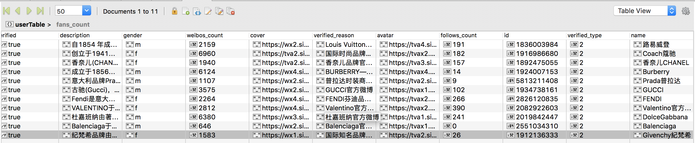

# 说明

python3 + scrapy + Mongodb

* [参考了该博客](https://segmentfault.com/a/1190000008334147), 他描述了如何爬取“豆瓣图书信息”，"微博数据"
* [利用爬虫技术能做到哪些很酷很有趣很有用的事情？](https://www.zhihu.com/question/27621722)
* [有哪些网站用爬虫爬取能得到很有价值的数据？](https://www.zhihu.com/question/36132174/answer/70798699)

## 目标

爬取品牌账号的微博

```
- 路易威登 [louisvuitton,               1836003984, https://weibo.com/u/1836003984]
- Coach蔻驰[coachchina,                1916986680, https://weibo.com/u/1916986680]
- 香奈儿CHANEL[chanel,                 1892475055, https://weibo.com/u/1892475055]
- Balenciaga[officialbalenciaga,      2551034310, https://weibo.com/u/2551034310]
- Burberry[burberry,                  1924007153]
- DolceGabbana[dolcegabbanaofficial,  2019842447, https://weibo.com/u/2019842447]
- Prada普拉达[pradaofficial,           5813211408, https://weibo.com/u/5813211408]
- GUCCI[gucci,                        1934738161, https://weibo.com/u/1934738161]
- FENDI[fendi,                        2826120835, https://weibo.com/u/2826120835]
- Valentino官方微博[valentinoofficial, 2082922603, https://weibo.com/u/2082922603]
- Givenchy紀梵希[officialgivenchy,     1912136333, https://weibo.com/u/1912136333]
```

## 工具 (MySQL, Redis 本项目未使用到)

* python-3.5
	- [Python yield 使用浅析](https://www.ibm.com/developerworks/cn/opensource/os-cn-python-yield/)
* python 环境管理工具 conda
* [mongo](https://blog.csdn.net/tymatlab/article/details/78532176), [mac系统下安装、启动、停止mongodb](https://www.cnblogs.com/haonanZhang/p/8213947.html), [mongoDB状态页面](https://www.cnblogs.com/ee900222/p/mongodb_1.html), [配置文件文档](https://docs.mongodb.com/manual/reference/configuration-options/), [配置文件范例](https://www.jianshu.com/p/f179ce608391), [MongoDB客户端管理工具 RoboMongo](https://blog.csdn.net/chszs/article/details/51348248), [NotMasterError, 建议命令行操作](https://www.jianshu.com/p/3a2acd1328a9)
  ```
	brew services start mongodb  ---启动
	brew services stop mongodb --停止
	brew services restart mongodb --重启
	或者
	mongod --config /usr/local/etc/mongod.conf --启动
	use admin, db.shutdownServer() --关闭

	mongod --dbpath=/data/db --fork --logpath=/data/server/mongodb/logs --noauth --httpinterface
	```

	```
	// 导出
	mongoexport -d test -c users --csv -f name,age  -o e:\python\users.csv
	```

* [redis]()
	- 分布式爬取: [scrapy-redis](https://github.com/rolando/scrapy-redis)
* [mysql](https://dev.mysql.com/downloads/file/?id=479845)
	- root, 123!@#qweQWE

## 样例

